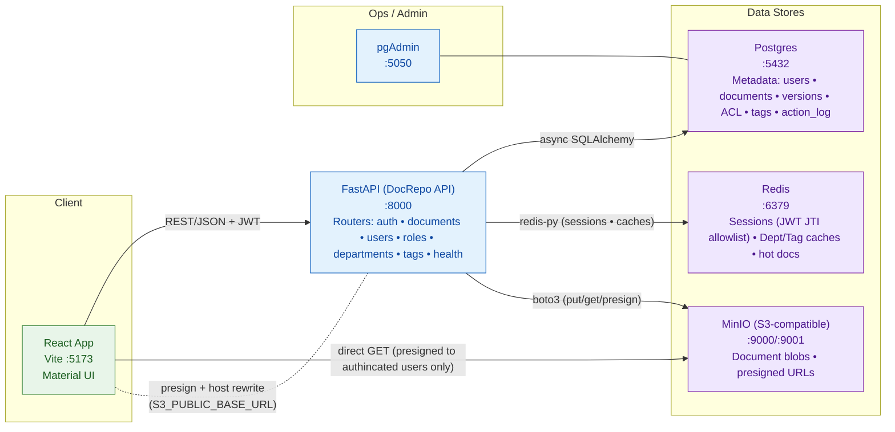

# Document-Repo-System
## Introduction

A lightweight **Document Repository System** for a company with multiple **departments** and **roles**. Teams can **upload**, **version**, **search**, and **share** documents with clear, department-based permissions.

- **Access control:** department & role aware (owner / edit / view)
- **Versioning:** full history with a clear “latest” version
- **Search:** by title, tags, and uploader
## System Arch.

## Design choices — What I did & Why

### 1) Authentication & sessions
**What I did:**  
Used JWT for auth (access + refresh). Stored the **access token JTI** in Redis as an allowlist and checked it on every request. On logout, I delete the access JTI and wipe all refresh JTIs for that user.

**Why:**  
This gives **instant session revocation** (no DB round-trips to validate tokens) and simple, scalable stateless auth. It’s easy to reason about and works cleanly with FastAPI’s dependency injection.

---

### 2) Authorization (department-level ACL)
**What I did:**  
Modeled per-document permissions via `doc_access(access_level)` where **lower = more privilege**: `≤2 owner`, `<5 edit`, `<3 modify/delete`. Admin role bypasses checks.

**Why:**  
Keeps auth **expressive yet query-friendly**. A single indexed lookup answers “can X do Y?”, and the thresholds make policy easy to communicate and enforce.

---

### 3) Storage design
**What I did:**  
Stored file **blobs** in S3/MinIO under versioned keys `docs/{doc_id}/v{n}/filename`. Kept all **metadata** (titles, descriptions, visibility, ACLs, tags, versions, checksums/sizes, audit logs) in Postgres.

**Why:**  
Relational metadata enables **strong consistency** and rich queries; object storage handles **durable, scalable** file blobs. This separation is standard, cost-effective, and reliable.

---

### 4) Downloads (presigned + host rewrite)
**What I did:**  
Generated presigned `get_object` URLs via boto3, then **rewrote the host** to `S3_PUBLIC_BASE_URL` before returning to the client. Also exposed an optional `/download-inline` that streams via the API when direct S3 access isn’t available.

**Why:**  
Direct browser → S3 download is **fast and cheap** (zero-copy through the API). The host rewrite fixes Docker internal hostnames. The inline endpoint is a safe fallback when S3 isn’t publicly reachable.

---

### 5) Caching strategy (Redis)
**What I did:**  
Used Redis for:
- **Session registry**: `auth:jti:*`, `auth:rjti:*`, `auth:user:{email}:rset`
- **Tag cache & typeahead**: `tag:index`, `tag:lex`, `tag:name2id`
- **Department snapshots**: `dept:index`, `dept:{id}`
- **Usage hints**: `hot:docs`, `recent:doc:{id}`

**Why:**  
Accelerates hot paths (typeahead, dept lookups, “recent” UX) while keeping the DB as the system of record. Startup warmers keep caches fresh automatically.

---

### 6) Search UX & performance
**What I did:**  
Implemented title search with Postgres **trigram** index for partials, tag filtering via joins on `document_tag/tag`, and an optional filter by **latest uploader** using a partial index. The API returns each document with **latest version summary** and **tags**.

**Why:**  
Delivers a responsive search experience without additional infrastructure. Trigram indexes are proven for “LIKE %term%” queries in Postgres.

---

### 7) Auditability
**What I did:**  
Logged uploads, metadata edits, and tag changes to `action_log` with **user_id**, **IP**, **doc_id/version_no**, and timestamp.

**Why:**  
Provides a clear audit trail for compliance, debugging, and security reviews.

---

### 8) Versioning model
**What I did:**  
Stored every upload in `document_version`; maintained exactly one row per document with `is_latest = true` (transactionally toggled).

**Why:**  
Gives **O(1)** “latest” reads while preserving complete history for rollbacks and audits.

---

### 9) Observability & ops
**What I did:**  
Added a very simple `/health` for liveness/readiness, structured logs, and **startup cache warmers** that snapshot departments and tags into Redis. Shipped a **Docker Compose** stack (API, Postgres, Redis, MinIO, pgAdmin) for parity between dev and local ops.

**Why:**  
Keeps the service **easy to run and diagnose**. Reproducible local environments shorten feedback loops and onboarding.

---

### 10) Security defaults
**What I did:**  
Rejected `.exe` uploads, enforced ACLs on all writes, required explicit grants for `restricted` visibility, and loaded secrets/config from `.env` via `pydantic-settings`.

**Why:**  
Reduces common risks by default and centralizes configuration for safer deployments.
## Containerization — Docker & Compose (short)

**What I did:**  
Packaged the stack into containers (API, Postgres, Redis, MinIO) and orchestrated them with **Docker Compose** for a one-command local environment.

**Why:**  
- **Reproducible dev** — same stack for everyone with `docker compose up`.  
- **Dev–prod parity** — local DB/cache/object store mirrors real infra.  
- **Simple ops** — built-in networking and env config; quick reset/teardown.  
- **Fast onboarding** — no manual installs; instant spin-up for contributors.  
- **Future-ready** — boundaries map cleanly to Kubernetes or cloud PaaS later.---
## Architecture style — MVC (SPA + API) by Choice

**What I did:**  
Adopted a **SPA + API** variant of MVC rather than classic server-rendered MVC.  
- **Model:** SQLAlchemy ORM entities + Pydantic request/response schemas  
- **Controller:** FastAPI routers/services orchestrating auth, validation, and use-cases  
- **View:** React (Material UI) SPA consuming the API over HTTP/JSON  
No server-side templates; the backend is an API-only app.

**Why:**  
- **Richer UX:** Drag-and-drop upload, typeahead, optimistic UI, and theming are better suited to a SPA.  
- **API-first reuse:** Keeps contracts clear for future integrations (CLI, jobs, other services).  
- **Independent evolution:** Frontend and backend can build, deploy, and scale separately.  
- **Testability & boundaries:** Clean separation of concerns; the API boundary matches natural service seams if we decompose later.

## Architecture style — Monolith by choice

**What I did:**  
Kept the backend as a **modular monolith** (routers/services/cache/storage in one deployable). The React SPA talks to this API; Postgres, Redis, and MinIO are shared components within the same Compose network.

**Why:**  
- **Right-sized for scope & scale:** The service set (auth, documents, tags, ACL, audit) is cohesive and not large enough to warrant the **complexity and overhead** of microservices and their data management.  
- **Small team, high velocity:** One codebase, one pipeline, one deploy target → faster iteration and simpler operations.  
- **Strong consistency:** Multi-table updates + S3 interactions fit cleanly in **atomic transactions**; avoiding sagas/queues at this stage.  
- **Lower latency & fewer failure modes:** In-process calls beat cross-service hops.  
- **Simpler security:** Single API boundary (JWT + Redis allowlist) instead of mTLS and inter-service ACLs.  
- **Lean ops:** The Compose stack is easy to run, monitor, and support.

> **Industry note:** In a larger production ecosystem, this **document repository** would typically be **one microservice** within a broader platform (alongside identity, billing, global search/analytics, notifications, etc.). This monolith is an intentional **deployment choice for today’s scale**; the code is modular enough to peel off components later (auth, ingest/processing, search, audit streaming).
